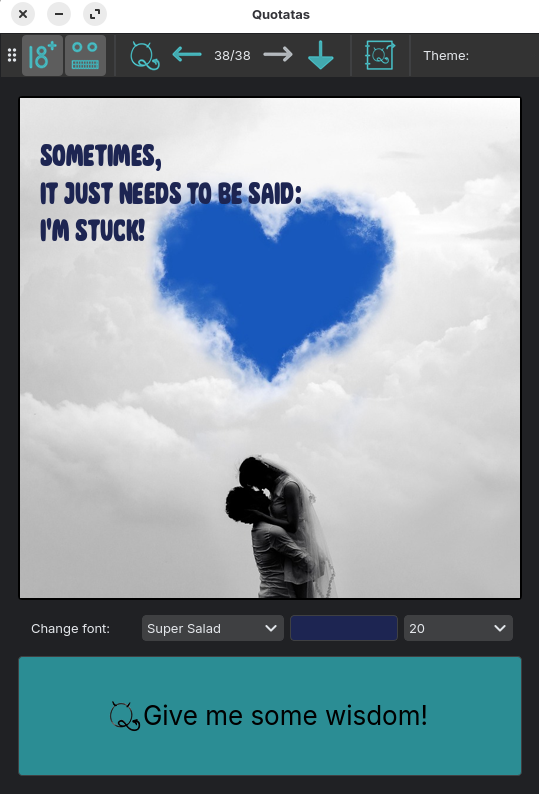

Quotatas is inspired by our good old friend Inspirobot. 
One of the things that makes Inspirobot a bit tricky sometimes is that it includes NSFW words, questionable images, and sometimes very negative words - it can be a thrill, but it's not for everyone.
Quotatas provides toggles for including NSFW and 'negative' content, so that you can choose what you're in the mood for that day.

The images used are royalty-free stock photos or my own photos, and the fonts used are free for commercial use. My gratitude goes out to the creative people who made them available.
Quotatas is free for personal use and is not intended for commercial use.

You need Pyside6, Pillow, and PyQtDarktheme (2.1.0) to be installed on your machine to make Quotatas work.

If you'd like to customise Quotatas:
* Add your own words to the files in word_lists. One item per line. 
* Add images and fonts to their respective folders, and you need to add their names and settings to the `font_collection` and `image_collection` CSV files in the `resources` folder. Images should be .png, 500x500 pixels. Fonts should include numbers, ':', '!', '%', and '-'.
* Add your own templates to `template_collection.py`.

